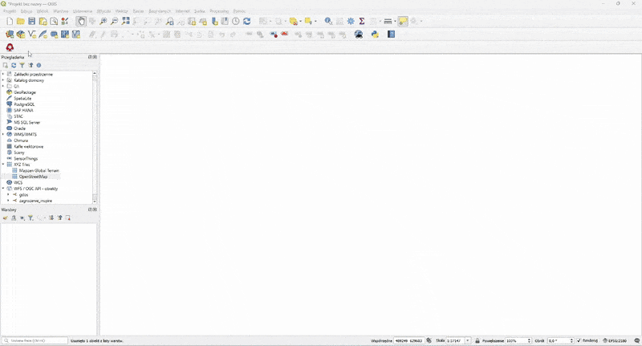

# PL

# Wtyczka QGIS - Archiwalna Ortofotomapa

## Opis

Archiwalna Ortofotomapa to bezpłatna wtyczka stworzona dla programu QGIS , która umożliwia użytkownikom przeglądanie ortofotomap Polski z różnych okresów.
 W prosty sposób można za pomocą suwaka wyświetlić ortofotomapę z konkretnego momentu z przeszłości.
  Dodana ortofotomapa jest automatycznie ustawiania na bieżący rok i przybliżana do Warszawy.

## Wymagania

- Program QGIS w wersji 3.28 lub nowszej.

## Instrukcja pobrania
1. Wtyczkę należy zainstalować w QGISie jako ZIP bądź wgrać pliki wtyczki do lokalizacji C:\Users\User\AppData\Roaming\QGIS\QGIS3\profiles\default\python\plugins.
2. Aby uruchomić wtyczkę należy kliknąć na ikonę drzewa oznaczonego symbolem zegara.
3. Jeżeli ikona wtyczki nie jest widoczna w górnym panelu, spróbuj zrestartować QGIS.
4. Jeżeli wtyczka nadal nie jest widoczna  należy przejść w QGIS Desktop do Wtyczki -> Zarządzanie wtyczkami -> Zainstalowane -> Archiwalna Ortofotomapa -> Odinstalować wtyczkę, i zainstalować ponownie. 

## Instrukcja użytkowania

1. Uruchom program QGIS i załaduj swoje dane lub projekt.
2. Kliknij na ikonę Archiwalnej Ortofotomapy w panelu narzędzi.
3. W oknie wtyczki pojawi się suwak umożliwiający wybór daty.
4. Przesuwając suwak, wybierz interesujący cię okres, a wtyczka automatycznie wyświetli odpowiednią ortofotomapę.
5. Jeżeli zniknął niebieski pasek w dole ekranu QGISa (pasek postępu), a dalej jest widoczny biały ekran, to są dwie możliwości:
    a. Nie istnieje ortofotomapa dla wybranego roku, dla danego obszaru.
    b. Wystąpił błąd z połączeniem z serwerem geoportal.gov.pl. W tym wypadku należy przybliżyć/oddalić zakres, aby mapa załadowała się ponownie. Wynika to z faktu, że połączenie WMS z geoportalem czasami może powodować błędy.

## Przykład użycia

# EN

# QGIS Plugin - Historical Orthophotomap

## Description

The Historical Orthophotomap is a free plugin created for QGIS, allowing users to browse orthophotomaps of Poland from various time periods. 
 With a simple slider, you can display an orthophotomap from a specific moment in the past.
  The added orthophotomap is automatically set to the current year and zoomed to Warsaw.
## Requirements

- QGIS software version 3.28 or higher.

## Installation Instructions

1. To install the plugin in QGIS, you should either install it as a ZIP file or upload the plugin files to the following location: C:\Users\User\AppData\Roaming\QGIS\QGIS3\profiles\default\python\plugins.
2. To run the plugin, click on the icon of a tree labeled by clock symbol
3. If the plugin icon is not visible in the upper panel, try restarting QGIS.
4. If the plugin is still not visible, go to QGIS Desktop, select Plugins -> Manage Plugins -> Installed -> Historical Orthophotomap -> Uninstall the plugin, and then reinstall it.

## Usage Instructions

1. Start QGIS and load your data or project.
2. Click on the icon of the Historical Orthophotomap in the toolbar.
3. In the plugin window, a slider will appear, allowing you to choose a date.
4. By moving the slider, select the period of interest, and the plugin will automatically display the corresponding orthophotomap.

## Example usage

